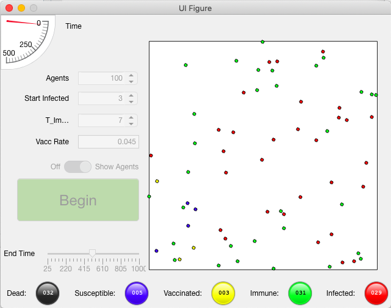
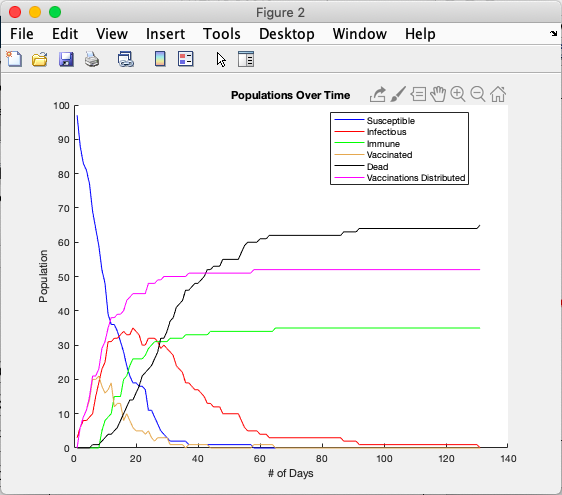
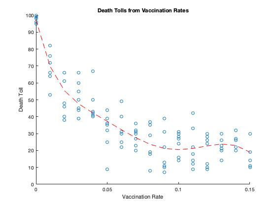

# Herd Immunity Mathematical Model
This program runs a simulation where a population of agents race against time to develop immunity from an infectious disease.

##### The Rules

- Agents are bound to a square with wrapping boundaries
- Agents take small steps each turn
- A small number of agents start at time zero as infected
- Susceptible agents that get close to infected agents run the risk of getting infected
- Infected agents remain infected, but have a chance of dying each turn
- Susceptible agents have a change to receive vaccination each turn, at which point they start becoming immune to the infection.

##### The GUI

Configurables:

- Number of agents
- Initial number of infected agents
- Time from vaccination to immunity
- Vaccination probability for Susceptible agents each turn
- Time until ending the simulation

##### Results

Populations are tracked over time and are plotted at the end of the simulation.

The blue line is easiest to track; over time there is no susceptible population. This group initially gets brought either into the infected or vaccinated population. Around Day 20 the death toll reaches it's peak and then drops over time. This is the curve we have to flatten regarding covid-19. Then, the infected start dying and the vaccinations start doing their job. Eventually we are left with only the dead and immune populations. Notice that the curves follow the shapes of exponential growth and decay, despite this being a discrete model.

The correlation to study relates the probability of vaccination at each time step with the total death toll upon concluding the simulation. As this was a class project, we solicited out classmates to collect sample data.

Approaching `vaccination rate = 0`, the data shows in essence that people who survived were only those who receive vaccinations. Towards `vaccination rate = 0.1` people get vaccinated faster than the virus can spread; as such we see no further improvement past that point.

The most important feature is the trend starting at 0.02. The curve doesn't perfectly follow exponential decay. We begin to see the effects of herd immunity. The disease spreads through physical space using people as a conduit. The disease can no longer spread easily if said conduit is replaced by an insulator in the form of a vaccinated agent. Increasing the vaccinated population decreases the area of effect of the disease at any given time step, thus increasing the probability that an agent receives a vaccination; as if before they simply have a higher rate each turn of receiving a vaccination before getting infected, now they also have more timesteps before encountering the disease to begin with. It's a positive feedback mechanism that holds at certain values of the vaccination rate, even if the population isn't receiving vaccinations all at once.

 